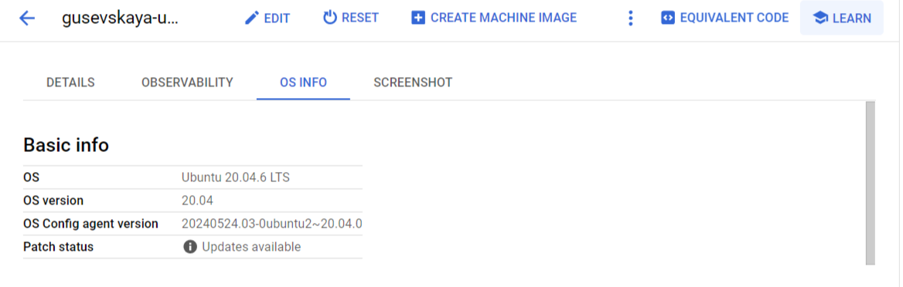
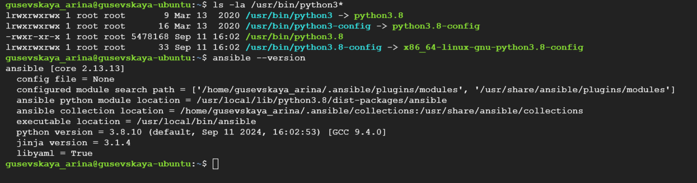
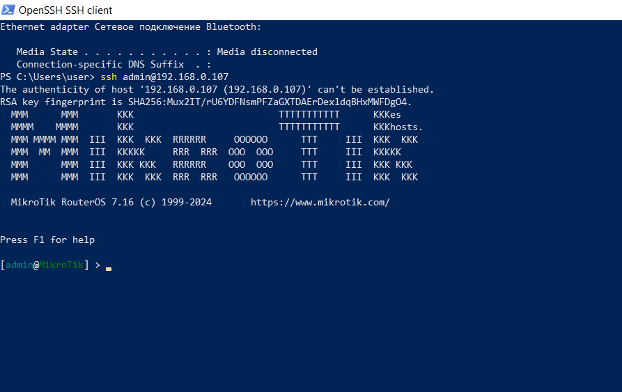
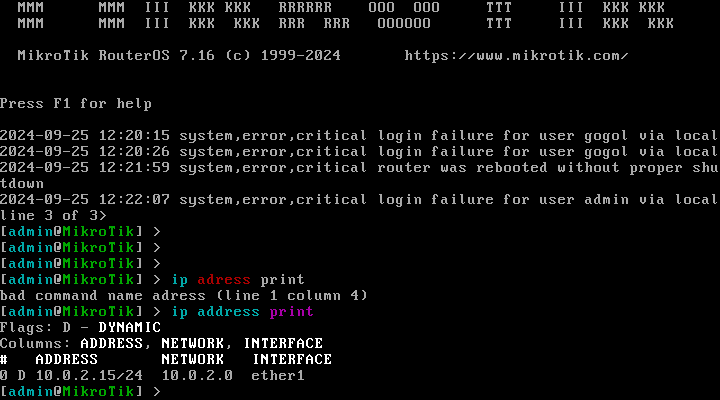

University: [ITMO University](https://itmo.ru/ru/)  
Faculty: [FICT](https://fict.itmo.ru)  
Course: [Network programming](https://github.com/itmo-ict-faculty/network-programming)  
Year: 2024/2025  
Group: K34202  
Author: Gusevskaya Arina  
Lab: Lab1  
Date of create: 25.09.2024  
Date of finished: 26.09.2024 

## Лабораторная работа №1 "Установка CHR и Ansible, настройка VPN"

<b>Описание:</b> данная работа предусматривает обучение развертыванию виртуальных машин (VM) и системы контроля конфигураций Ansible а также организации собственных VPN серверов.

<b>Цель работы:</b> развернуть виртуальную машину на базе платформы GCP с установленной системой контроля конфигураций Ansible и установить CHR в VirtualBox.

### Ход работы
#### Создание ВМ на GCP
1. Создадим ВМ в Google Cloud на образе Ubuntu 20.04

2. Проверим конфигурацию и корректность работы ВМ.

3. Установим python3 и ansible. Убедимся, что всё установлено корректно.

P.S. В команде проверки `ls -la /usr/bin/python3*` используем символ *, потому что мы не знаем, какая конкретно версия установлена и не можем её указать.

#### Установка CHR (RouterOS) на VirtualBox
1. Создадим ВМ с помощью Oracle VirtualBox с образом, который был скачат с сайта mikrotik.com

2. Узнаем ip-адресс СНR

3. Подключимся по ssh через Windows PowerShell. Подключение выполнилось успешно не сразу (см. ниже)

 Возникшие трудности 

В изначальном варианте при выполнении команды `ip address print`, был выдан ip: 10.0.2.15. Подключение по shh выдавало ошибку ssh: `connect to host 10.0.2.15 port 22: Connection timed out`.

Мне пришлось изучить много разных материалов по этой проблеме и потратить годы...(ну или немного меньше). Конечно, я делала проброс портов и диагностику, конфигурацию ssh, отключение firewall и всё такое. НО в этот раз мне попалась статья от доброго человека на Яндекс Дзен, который освежил в моей голове простые истины и всё получилось. Ссылка на статью: <https://dzen.ru/a/YyBI-9K0nk2MWmSd>

### Результаты лабораторной работы

### Вывод
В ходе лабораторной работы была развернута виртуальная машина на базе платформы GCP с установленной системой контроля конфигураций Ansible, а также CHR в VirtualBox. Между ними был настроен WireGuard туннель.
