University: [ITMO University](https://itmo.ru/ru/)  
Faculty: [FICT](https://fict.itmo.ru)  
Course: [Network programming](https://github.com/itmo-ict-faculty/network-programming)  
Year: 2024/2025  
Group: K34202  
Author: Gusevskaya Arina  
Lab: Lab2 
Date of create: 10.10.2024  
Date of finished: 22.11.2024 

## Лабораторная работа №2 "Развертывание дополнительного CHR, первый сценарий Ansible"

<b>Описание:</b> В данной лабораторной работе будет осуществлено практическое знакомство с системой управления конфигурацией Ansible, использующейся для автоматизации настройки и развертывания программного обеспечения.
<p><b>Цель работы:</b> с помощью Ansible настроить несколько сетевых устройств и собрать информацию о них. Правильно собрать файл Inventory.</p>

### Ход работы
#### Развертывание дополнительного CHR
1. Создадим ВМ с помощью Oracle VirtualBox с образом, который был скачан с сайта mikrotik.com.

*Нужно скачать образ другой версии или сохранить файл в другой директории (переименовать), иначе конфигурация новой ВМ будет такая же, как у предыдущей. При первой настройке на второй ВМ у меня уже был настроен интерфейс wg первой машины (это помешало бы нам выполнить задания лабораторной). В итоге CHR называются Mikrotik и Mikrotik1.

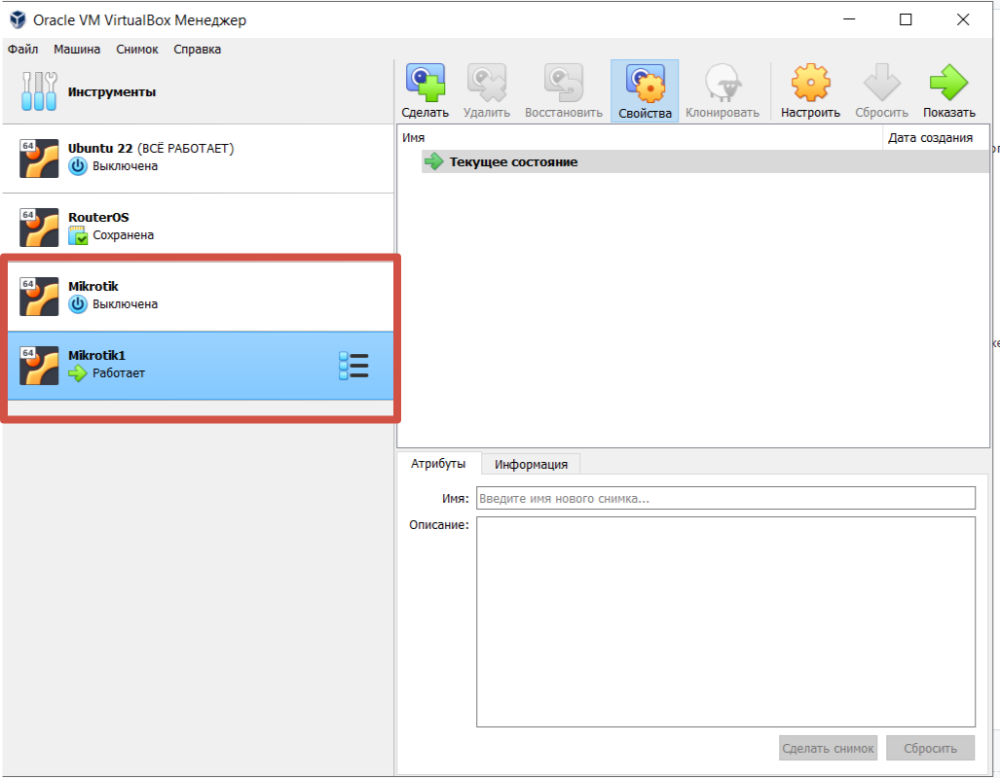

2. Запустим обе машины и убедимся, что они имеют разные ip-адреса.

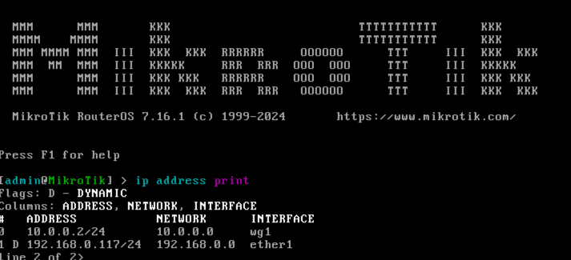
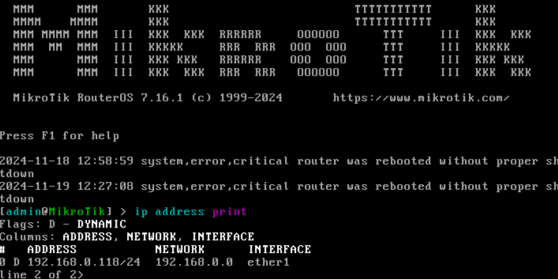

3. В этот раз настроим CHR клиент через веб-интерфейс. Создадим интервейс wg2 на клиенте и соответствующий peer.

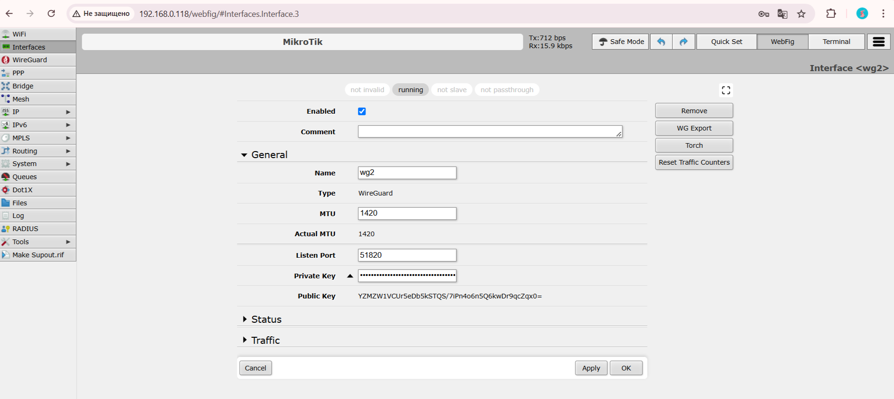
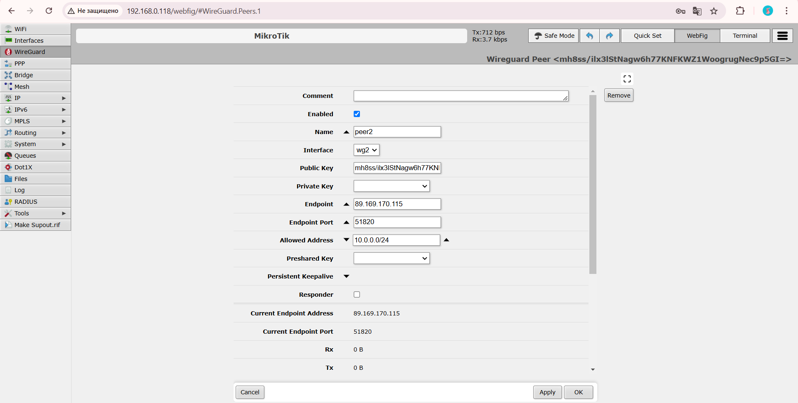

4. Добавим информацию о новом клиенте в конфигурационный файл wg0.conf в директории etc/wireguard/ на сервере. Добавим IP.

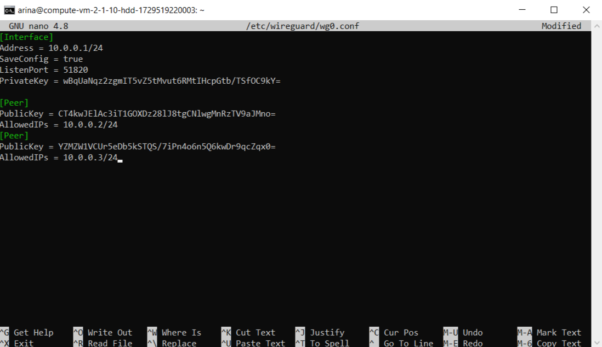
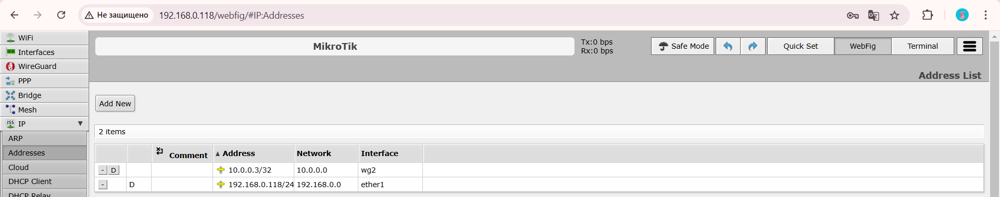

5. Пропингуем сервер с клиентов, чтобы протестировать связь.
   
CHR1 -> сервер

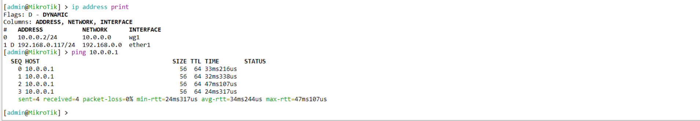

CHR1 -> CHR2


CHR2 -> сервер

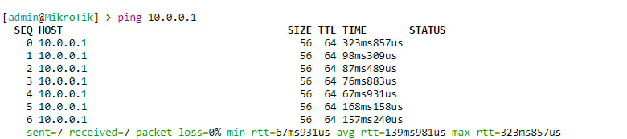

<details>
   
<summary><b>Возникшие трудности</b></summary>
<p></p>

В лабораторной работе №1 было приянто решение развернуть VPN сервер на Google Cloud. При первом подключении VPN туннель был создан и протестирован успешно. Но при выполнении лабороторной работы №2 возникли трудности при попытке подключения. По совету преподавателя, было принято решение развернуть сервер на Yandex Cloud и повторно создать Wireguard VPN туннель c клиентом на ВМ Mikrotik.

1. Создадим ВМ в Yandex Cloud на образе Ubuntu 20.04.

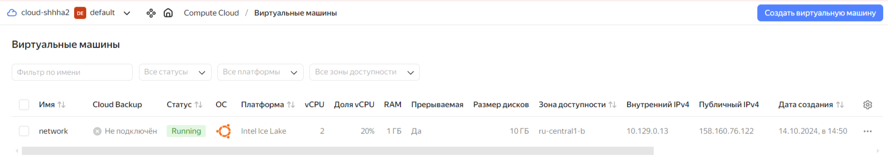

2. Кто я..?

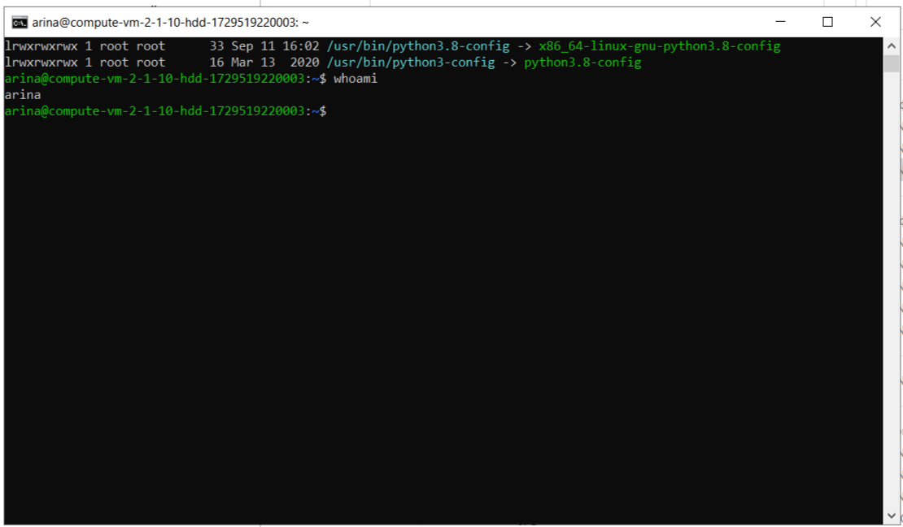

3. Установим python3 и ansible. Убедимся, что всё установлено корректно.
   
P.S. В команде проверки `ls -la /usr/bin/python3*` используем символ *, потому что мы не знаем, какая конкретно версия установлена и не можем её указать.

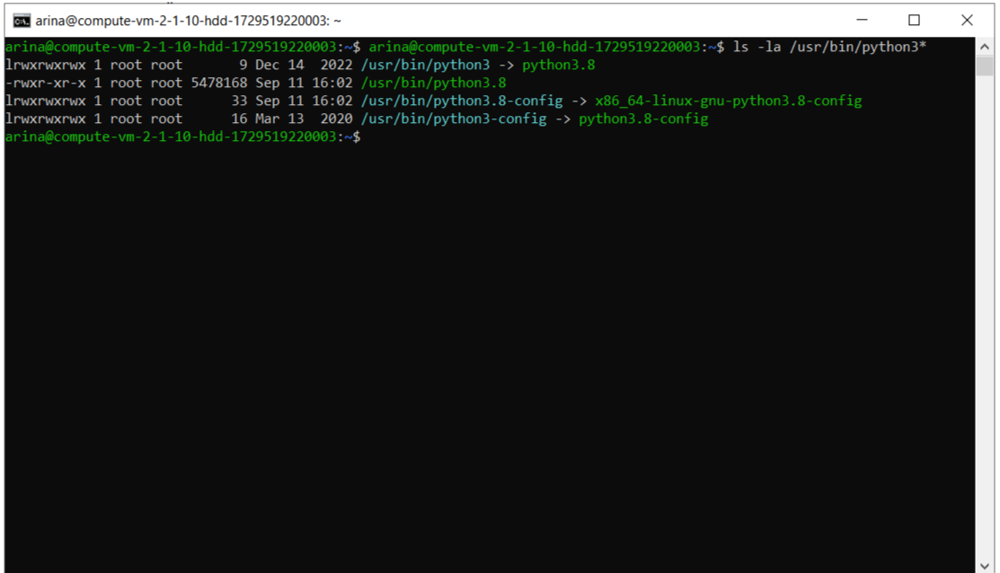

</details>

3. Схема сети будет выглядеть следующим образом. Приведем её без нанесения ip-адресов.

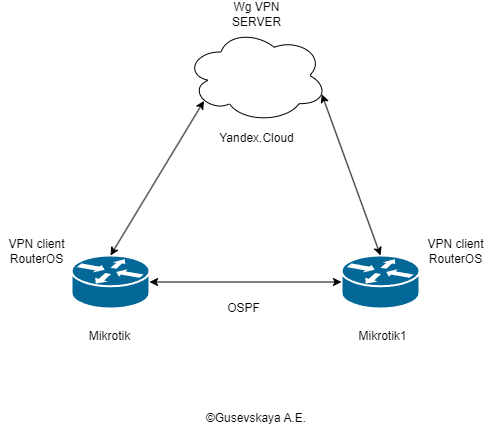  

### Настройка Ansible

Используя Ansible настроим на 2-х CHR:
* логин/пароль;
* NTP Client;
* OSPF с указанием Router ID;
* сбор данных по OSPF топологии и полный конфиг устройства.

1. Перед настройкой проверим версию Ansible и что коллекция для roterous установлена.
  
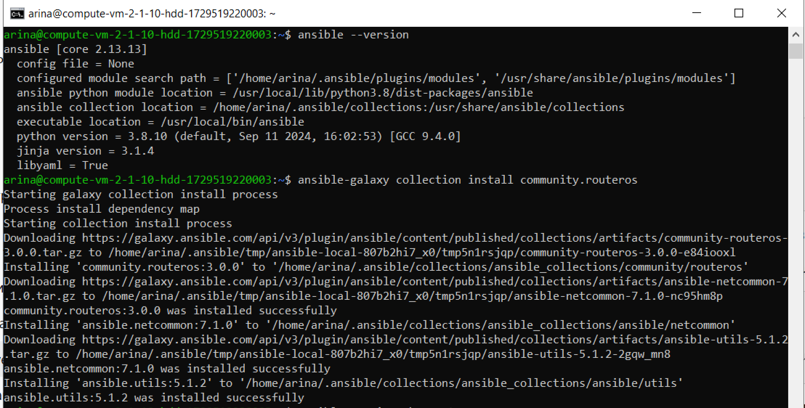  

2. Ansible использует SSH для подключения к удаленным хостам. Чтобы избежать возможных ошибок (о них часто пишут на SOF), создадим публичный ключ на сервере и импортируем его на клиентов.

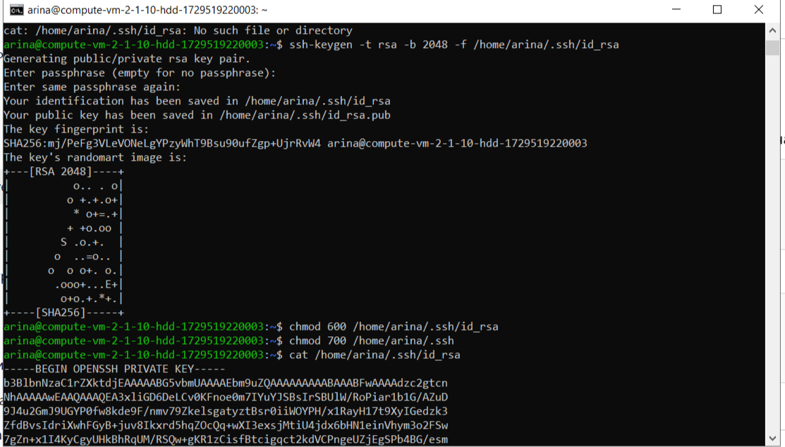  

3. Далее создадим inventory/hosts — это файл инвентаря (inventory file), который используется в Ansible для управления списком хостов (управляемых узлов). Он содержит информацию о хостах, которыми нужно управлять, их группах, а также дополнительные параметры подключения.

```
[chr_routers]
chr1 ansible_host=10.0.0.2 ansible_user=admin
chr2 ansible_host=10.0.0.3 ansible_user=admin

[chr_routers:vars]
ansible_connection=ansible.netcommon.network_cli
ansible_network_os=community.routeros.routeros
ansible_ssh_private_key_file=/home/arina/.ssh/id_rsa
```

4. И конфигурационныйй файл. Где прописано, что где лежит.

```
[defaults]
inventory = ./inventory/hosts
host_key_checking = False
ansible_remote_tmp = /tmp
collections_paths = /home/arina/.ansible/collections:/usr/share/ansible/collections
```
5. Плейбук выглядит следующим образом:

```
- name: Configure CHR routers with user credentials, NTP client, and OSPF
  hosts: chr_routers
  gather_facts: no
  vars:
    router_ospf_ip: "{{ '10.255.255.1/32' if ansible_host == '10.0.0.2' else '10.255.255.2/32' }}"
  tasks:
    - name: Set up user credentials
      community.routeros.command:
        commands:
          - /user add name=arina group=full password=111
      register: user_config

    - name: Enable NTP client and configure server
      community.routeros.command:
        commands:
          - /system ntp client set enabled=yes servers=0.ru.pool.ntp.org
      register: ntp_client_config

    - name: Configure OSPF
      community.routeros.command:
        commands:
          - /routing ospf instance add name=default
          - /interface bridge add name=loopback
          - /ip address add address={{ router_ospf_ip }} interface=loopback
          - /routing ospf instance set 0 router-id={{ router_ospf_ip }}
          - /routing ospf area add instance=default name=backbone
          - /routing ospf interface-template add area=backbone interfaces=ether1 type=ptp

    - name: Export router configuration
      community.routeros.command:
        commands:
          - /export
      register: router_config

    - name: Display router configuration
      debug:
        var: router_config.stdout_lines
```
5. Запустим его и получим следующий результат:

```
arina@compute-vm-2-1-10-hdd-1729519220003:~$ ansible-playbook chr_conf.yml

PLAY [Configure CHR routers with user credentials, NTP client, and OSPF] ***********************************************************************************

TASK [Set up user credentials] *****************************************************************************************************************************
changed: [chr2]
changed: [chr1]

TASK [Enable NTP client and configure server] **************************************************************************************************************
changed: [chr2]
changed: [chr1]

TASK [Configure OSPF] **************************************************************************************************************************************
changed: [chr2]
changed: [chr1]

TASK [Export router configuration] *************************************************************************************************************************
changed: [chr2]
changed: [chr1]

TASK [Display router configuration] ************************************************************************************************************************
ok: [chr1] => {
"router_config.stdout_lines": [
    [
        "# 2024-11-17 20:15:13 by RouterOS 7.16.1",
        "# software id = ",
        "#",
        "/interface bridge",
        "add name=loopback",
        "/interface wireguard",
        "add listen-port=51820 mtu=1420 name=wg1",
        "/routing ospf instance",
        "add disabled=no name=default",
        "/routing ospf area",
        "add disabled=no instance=default name=backbone",
        "/interface wireguard peers",
        "add allowed-address=10.0.0.0/24 endpoint-address=89.169.170.115 endpoint-port=\\",
        "    51820 interface=wg1 name=peer1 persistent-keepalive=25s public-key=\\",
        "    \"mh8ss/ilx3lStNagw6h77KNFKWZ1WoogrugNec9p5GI=\"",
        "/ip address",
        "add address=10.0.0.2/24 interface=wg1 network=10.0.0.0",
        "add address=10.255.255.1 interface=loopback network=10.255.255.1",
        "/ip dhcp-client",
        "add interface=ether1",
        "/ip firewall nat",
        "add action=masquerade chain=srcnat",
        "/ip ssh",
        "set always-allow-password-login=yes forwarding-enabled=both host-key-type=\\",
        "    ed25519",
        "/routing ospf interface-template",
        "add area=backbone disabled=no interfaces=ether1 type=ptp",
        "/system note",
        "set show-at-login=no",
        "/system ntp client",
        "set enabled=yes",
        "/system ntp client servers",
        "add address=0.ru.pool.ntp.org"
    ]
]
}
ok: [chr2] => {
"router_config.stdout_lines": [
    [
        "# 2024-11-17 20:15:13 by RouterOS 7.16.1",
        "# software id = ",
        "#",
        "/interface bridge",
        "add name=loopback",
        "/interface wireguard",
        "add listen-port=51820 mtu=1420 name=wg2",
        "/routing ospf instance",
        "add disabled=no name=default",
        "/routing ospf area",
        "add disabled=no instance=default name=backbone",
        "/interface wireguard peers",
        "add allowed-address=10.0.0.0/24 endpoint-address=89.169.170.115 endpoint-port=\\",
        "    51820 interface=wg2 name=peer2 persistent-keepalive=25s public-key=\\",

        "    \"mh8ss/ilx3lStNagw6h77KNFKWZ1WoogrugNec9p5GI=\"",
        "/ip address",
        "add address=10.0.0.3/24 interface=wg2 network=10.0.0.0",
        "add address=10.255.255.2 interface=loopback network=10.255.255.2",
        "/ip dhcp-client",
        "add interface=ether1",
        "/ip firewall nat",
        "add action=masquerade chain=srcnat",
        "/ip ssh",
        "set always-allow-password-login=yes forwarding-enabled=both host-key-type=\\",
        "    ed25519",
        "/routing ospf interface-template",
        "add area=backbone disabled=no interfaces=ether1 type=ptp",
        "/system note",
        "set show-at-login=no",
        "/system ntp client",
        "set enabled=yes",
        "/system ntp client servers",
        "add address=0.ru.pool.ntp.org"
    ]
]
}

PLAY RECAP *************************************************************************************************************************************************
chr1                       : ok=5    changed=4    unreachable=0    failed=0    skipped=0    rescued=0    ignored=0
chr2                       : ok=5    changed=4    unreachable=0    failed=0    skipped=0    rescued=0    ignored=0

```

Проверим на клиенте, что всё выролнено верно.

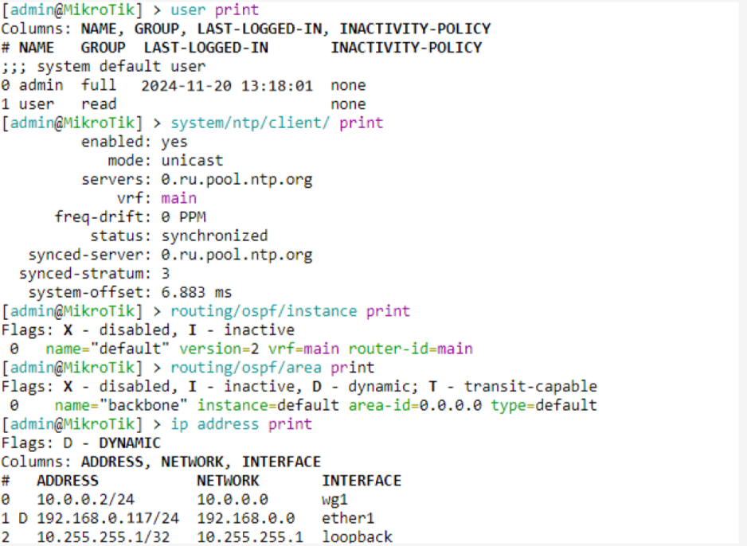 

### Вывод
В ходе лабораторной работы с помощью Ansible были настроены сетевые устройства и собрана информация о них.

