University: [ITMO University](https://itmo.ru/ru/)  
Faculty: [FICT](https://fict.itmo.ru)  
Course: [Network programming](https://github.com/itmo-ict-faculty/network-programming)  
Year: 2024/2025  
Group: K34202  
Author: Gusevskaya Arina  
Lab: Lab3
<br/>Date of create: 28.11.2024  
Date of finished: 06.12.2024 

## Лабораторная работа №3 "Развертывание Netbox, сеть связи как источник правды в системе технического учета Netbox"

<b>Описание:</b> в данной лабораторной работе вы ознакомитесь с интеграцией Ansible и Netbox и изучите методы сбора информации с помощью данной интеграции.
<p><b>Цель работы:</b> c помощью Ansible и Netbox собрать всю возможную информацию об устройствах и сохранить их в отдельном файле.</p>

### Ход работы
#### Установка Netbox

Поднимем Netbox в Yandex Cloud. При установке использовала [эту статью](https://jtprog.ru/netbox/) как гайд.

1. Установим PostgreSQL
> Совет от чемпиона по ошибкам: не забудьте выполнить команду ```sudo apt-get update``` перед установкой, сохраните час своей жизни.

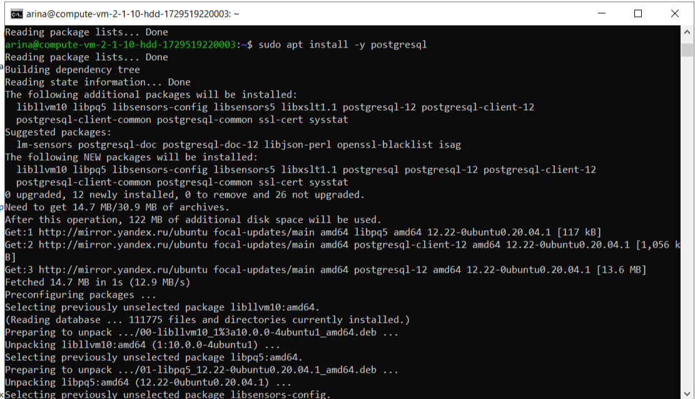

2. Подключимся к PostgreSQL.

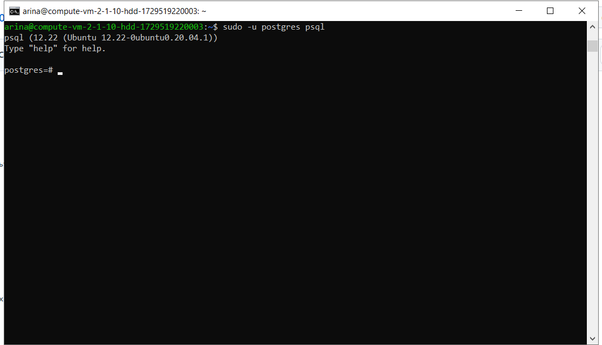


3. Создадим базу данных и пользователя netbox, зададим смешной пароль. !!!не забудем поставить точку с запятой в конце каждой строки.

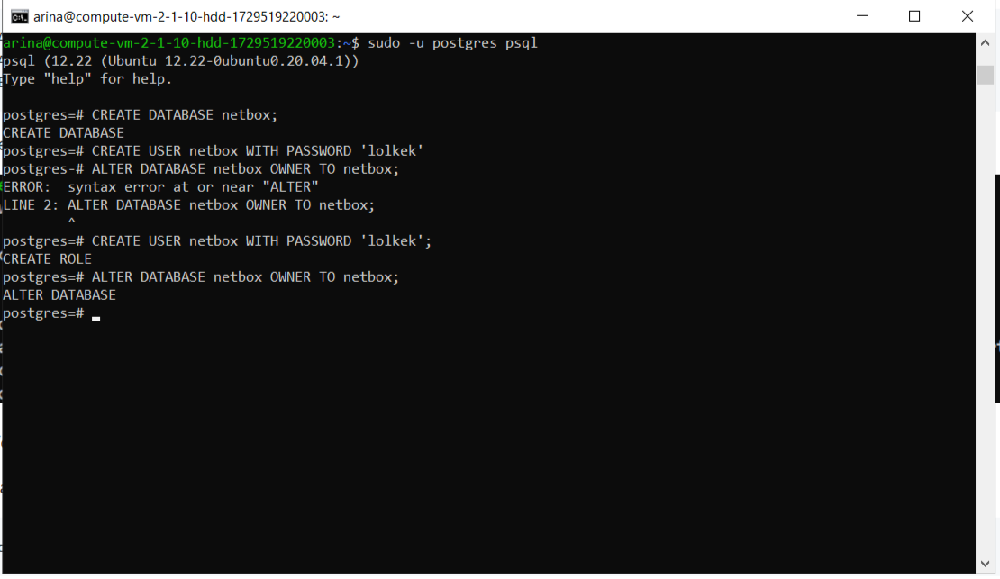

4. Проверим, что БД доступна для подключения. Ура, реально доступна.

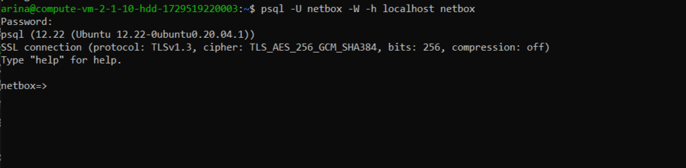

5. Установим Redis и поиграем с ним в пингпонг *радостно понгает*.

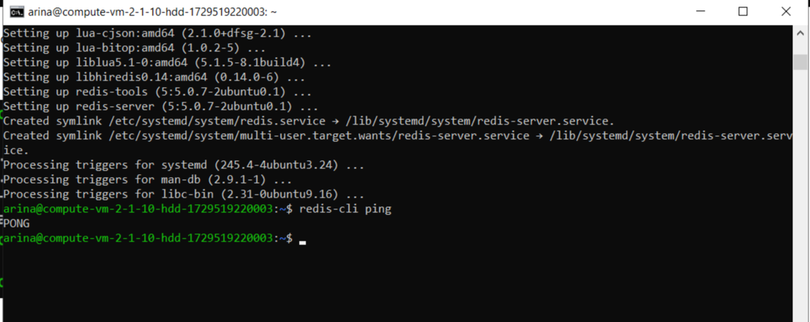

6. Переходим к установка и настройке NetBox. Перед этим установим все нужные пакеты. Создадим отдельную директорию для NetBox и склонируем туда репозиторий NetBox.

<b>Внимание!</b> Сюжетный твист. На этапе клонирования репозитория (да, пришлось установить гит) стали появляться ошибки (моя любимая с sudo) и я случайно нашла статью про установку netbox через docker. Cветлая мысль пришла мне в голову. Хочу всё сделать через Docker, нажатием одной кнопки. Спойлер: понадобилось двое суток.

7. Чудесная [статья](https://adsm.readthedocs.io/ru/latest/3_ipam_dcim/installation.html) с видео + [гитхаб](https://github.com/netbox-community/netbox-docker?tab=readme-ov-file) netbox 

8. Возникшие проблемы: пришлось вручную обновить версию docker compose до последней, проверять зависимости и смотреть логи контейнера netbox-1, потому что он заболел.

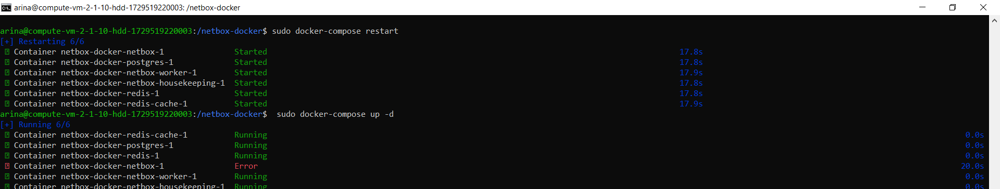

9. Фиксируем момент, когда всё хорошо(помогла перезагрузка YC).
```
git clone -b release https://github.com/netbox-community/netbox-docker.git
cd netbox-docker
tee docker-compose.override.yml <<EOF
services:
  netbox:
    ports:
      - 8000:8080
EOF
docker compose pull
docker compose up
```

Проверим контейнеры

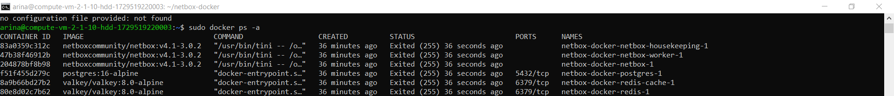

Убедимся, что стоит нужная версия docker-compose

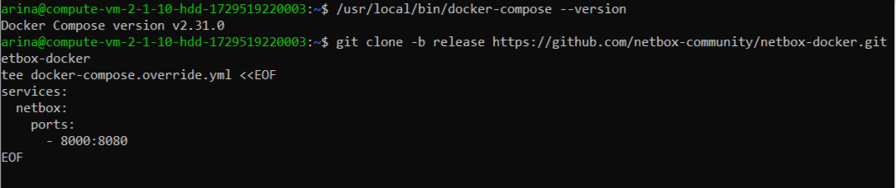

Запустим процесс

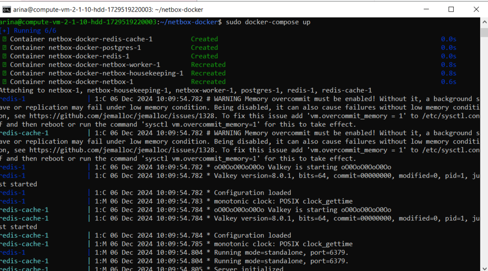

Победа! Примерно через 15 минут мы получаем доступ к приложению в веб-браузере.

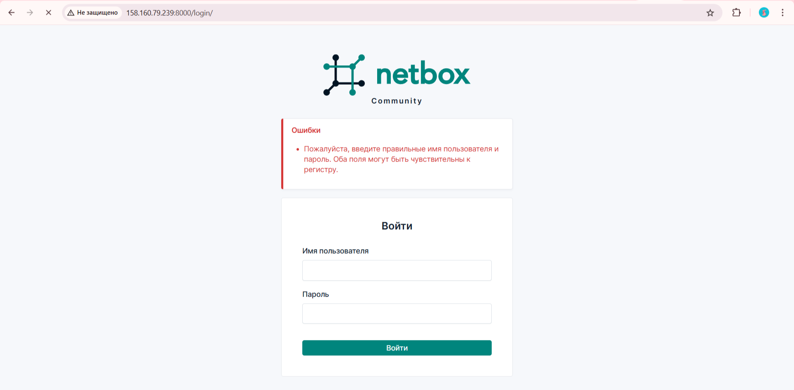

Создаем суперпользователя пользователя netbox ```docker compose exec netbox /opt/netbox/netbox/manage.py createsuperuser``` и заходим.

#### Основная часть

1. Добавим наши СНR в раздел "Устройства"

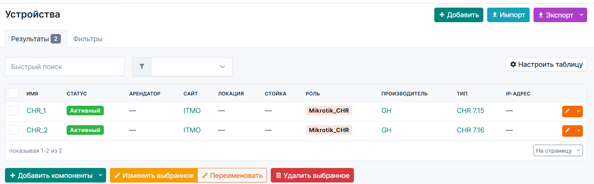

2. Установим ansible-модули для Netbox:

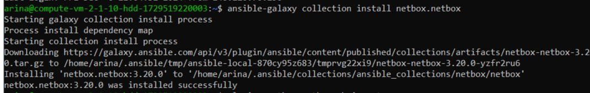

3. Создадим файл netbox_conf_galaxy.yml (токен генерируется в приложении netbox)
```
plugin: netbox.netbox.nb_inventory
api_endpoint: http://127.0.0.1:8000
token: 9ac3f4d2e3a74612b48e0fc19374ed125cde309f
validate_certs: True
config_context: False
interfaces: True
```
4. Сохраним вывод скрипта в файл командой `ansible-inventory -v --list -y -i netbox_conf_galaxy.yml > netbox_inventory.yml`

5. Перенесём переменные для подключения к роутерам:
```
  vars:
    ansible_connection: ansible.netcommon.network_cli
    ansible_network_os: community.routeros.routeros
    ansible_user: admin
    ansible_ssh_pass: 12345
```

6. Напишем плейбук для изменения имени устройства и добавления IP.
```
- name: Setup Routers
  hosts: ungrouped
  tasks:
    - name: "Change names of chr"
      community.routeros.command:
        commands:
          - /system identity set name="{{ interfaces[0].device.name }}"

    - name: "Change IP-address"
      community.routeros.command:
        commands:
          - /ip address add address="{{ interfaces[0].ip_addresses[0].address }}" interface="{{ interfaces[0].display }}"
```

Запустим playbook:

```
arina@compute-vm-2-1-10-hdd-1729519220003:~$ ansible-playbook -i inventory ansible-playbook.yml

PLAY [Setup Routers] ***************************************************************************************************************************************

TASK [Gathering Facts] *************************************************************************************************************************************
ok: [chr2]
ok: [chr1]

TASK [Change names of chr] *********************************************************************************************************************************
changed: [chr2]
changed: [chr1]

TASK [Change IP-address] ***********************************************************************************************************************************
changed: [chr2]
changed: [chr1]

PLAY RECAP *************************************************************************************************************************************************
chr1                       : ok=3    changed=2    unreachable=0    failed=0    skipped=0    rescued=0    ignored=0
chr2                       : ok=3    changed=2    unreachable=0    failed=0    skipped=0    rescued=0    ignored=0
```


7. Напишем сценарий, позволяющий собрать серийный номер устройства и вносящий серийный номер в Netbox.
```
arina@compute-vm-2-1-10-hdd-1729519220003:~$ cat serial_num.yml
---
- name: Collect and update serial number in NetBox
  hosts: chr_routers
  gather_facts: no
  vars:
    netbox_url: "http://158.160.79.239:8000/api/"
    netbox_api_token: "9ac3f4d2e3a74612b48e0fc19374ed125cde309f"

  tasks:
    - name: Gather serial number from the device
      community.routeros.command:
        commands:
          - /system license print
      register: serial_output

    - name: Verify that serial number was gathered
      fail:
        msg: "Could not find serial number"
      when: serial_number is not defined or serial_number == ""

    - name: Fetch device ID from NetBox
      uri:
        url: "{{ netbox_url }}/api/dcim/devices/?name={{ inventory_hostname }}"
        method: GET
        headers:
          Authorization: "Token {{ netbox_api_token }}"
        validate_certs: no
        return_content: yes
      register: netbox_device_data
      failed_when: "'results' not in netbox_device_data.json or netbox_device_data.json.results | length == 0"

    - name: Extract device ID from NetBox response
      set_fact:
        device_id: "{{ netbox_device_data.json.results[0].id }}"

    - name: Update serial number in NetBox
      uri:
        url: "{{ netbox_url }}/api/dcim/devices/{{ device_id }}/"
        method: PATCH
        headers:
          Authorization: "Token {{ netbox_api_token }}"
          Content-Type: "application/json"
        body: "{{ {'serial': serial_number} | to_json }}"
        status_code: 200
        validate_certs: no
      register: update_response

    - name: Check if serial number update was successful
      debug:
        msg: "Serial number for {{ inventory_hostname }} updated to {{ serial_number }} in NetBox"
      when: update_response.status == 200
```
8. Проверим, что появились серийные номера

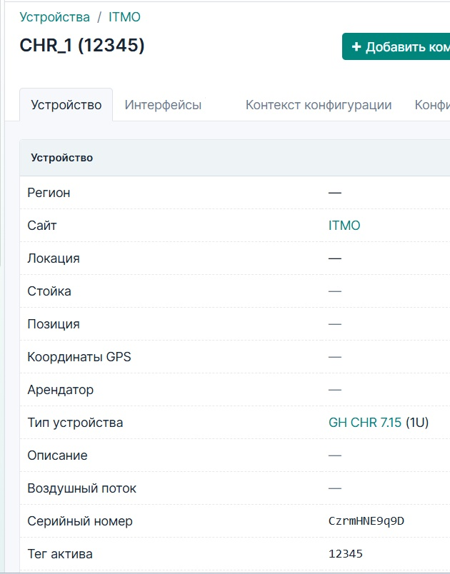

9. Изобразим схему связи в draw.io.

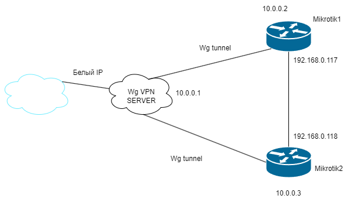


<p><b>Вывод:</b> в ходе выполнения данной лабораторной работе мы ознакомитесь с интеграцией Ansible и Netbox и изучили методы сбора информации с помощью данной интеграции.</p>
